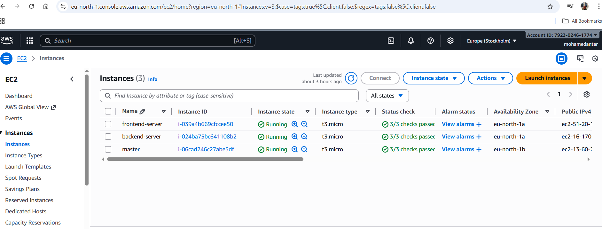
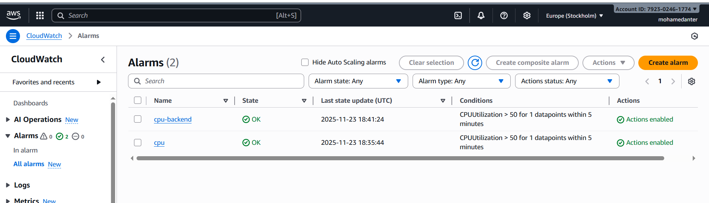
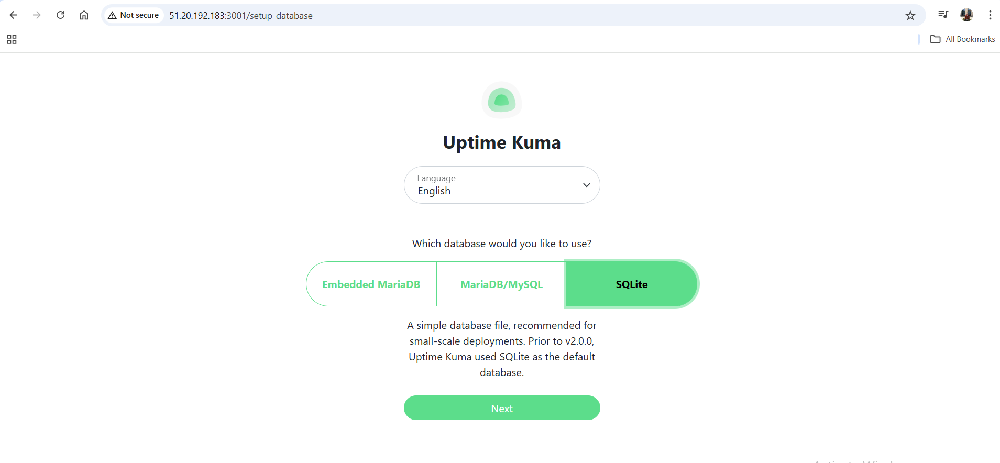
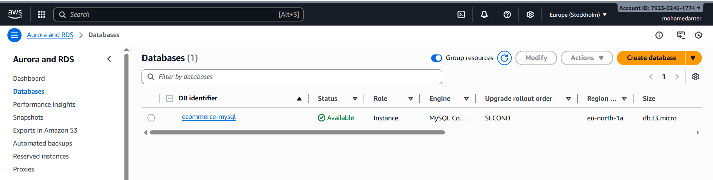

# DevOps Master Server Setup

This repository contains the complete setup, configurations, automation scripts, and deployment pipelines used on the master Ubuntu 22.04 instance for the DevOps project (Task Group A & B).

---

## 📦 Project Structure

```
.
├── laravel-app/ # Backend Laravel application
├── frontend-uptime-kuma/ # Frontend (Uptime Kuma via Docker Compose)
├── deploy.sh # Auto-deployment script for Laravel
├── docker-compose.yml # Frontend compose file
├── terraform/ # Terraform infrastructure code (EC2, RDS)
└── README.md
`````

---

## 🚀 Features Implemented

### **Task Group A (Terraform)**
- Backend EC2 instance (1 vCPU, 1GB RAM, 8GB disk)
- Frontend EC2 instance (1 vCPU, 1GB RAM, 8GB disk)
- MySQL RDS (engine 8.0, private subnet only)
- Security groups, attachments, outputs


*Instances running on AWS Console*
---

### **Task Group B (CI/CD)**

#### 🟢 **1. Frontend (GitHub Actions)**
- Trigger on push to `main`
- Build step (`echo building...`)
- SSH deployment to EC2
- Run Uptime Kuma using Docker Compose

#### 🟣 **2. Backend Laravel**
- Trigger on push to `main`
- SSH deploy script:
  - `git pull`
  - `composer install` (auto)
  - `php artisan migrate`
  - restart PHP service

#### 🔔 **3. Alerting**
Configured CloudWatch alarms:
- CPU > 50% for 5 minutes
- Email notifications via SNS
- Alarms created for:
  - Backend server
  - Frontend server


*Configured CloudWatch alarms on backend and frontend servers*

---

## 📂 Deployment Script Example (deploy.sh)


```
#!/bin/bash
cd ~/laravel
git pull
composer install --no-dev
php artisan migrate --force
sudo systemctl reload php8.2-fpm
`````
-----

---

## 🛠 Technologies Used
- AWS EC2
- AWS RDS
- AWS CloudWatch + SNS
- GitHub Actions
- Terraform
- Laravel 10
- Docker Compose
- Ubuntu 22.04 LTS

---

## ⚙️ Frontend App Running


*Uptime Kuma frontend running successfully*

---

## 🗄️ MySQL RDS Instance


*MySQL RDS instance without internet exposure*


## ✨ Author
Mohamed Anter  
Cloud DevOps Engineer  
GitHub: https://github.com/Mohamedanter845


